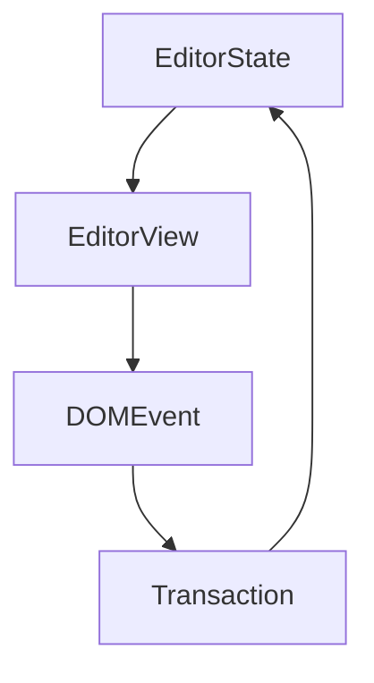

# 一级标题2

## 二级标题

> 引用

*   [ ] 交互式列表
*   123
*   123

***

你可以添加行内代码例如 `inline code` 和代码块：

```javascript
function main() {
    console.log('Hello milkdown!');
}
```

> Tips: 使用`Mod-Enter`来退出块级元素，例如代码块。

***

你可以输入`||`和一个空格来创建表格：

| 表头 1 |   表头 2   |
| ---- | :------: |
| 内容 1 | ~~内容 1~~ |
| 内容 2 | **内容** 2 |

***

数学公式通过 [TeX 表达式](https://en.wikipedia.org/wiki/TeX)支持。

这里我们有行内公式： $E = mc^2$，你可以点击并编辑它。

数学公式块也是支持的。

$$
\begin{aligned}
T( (v_1 + v_2) \otimes w) &= T(v_1 \otimes w) + T(v_2 \otimes w) \\
T( v \otimes (w_1 + w_2)) &= T(v \otimes w_1) + T(v \otimes w_2) \\
T( (\alpha v) \otimes w ) &= T( \alpha ( v \otimes w) ) \\
T( v \otimes (\alpha w) ) &= T( \alpha ( v \otimes w) ) \\
\end{aligned}
$$

你可以输入`$$`和一个空格来创建数学公式块。

***

使用 [emoji 快捷指令](https://www.webfx.com/tools/emoji-cheat-sheet/) 例如 `:+1:` 来添加 emoji.

在输入时，你也许注意到了 emoji 过滤器，尝试输入`:baby`来查看它。

***

图表由 [mermaid](https://mermaid-js.github.io/mermaid/#/)驱动。

你可以输入 ` ```mermaid ` 来添加图表。



***

Have fun!
